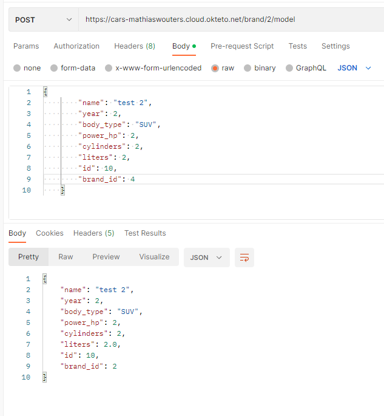

# API - Project

This project was part of the API Development course in my second year. We had to create an API of choice and because I'm very passionate about cars, I chose to build an API for off-road cars that could be used by car dealerships.

**Completed:** December 2022

## Off-Road Car API

For the API we had to use FastAPI which is a python framework to create APIs. In the API the user can send different get requests, each with a different parameter (such as: brand, model, year, body type, power, owner, ... ) and the user can also add a new car brand, car model or owner.

I focused on creating a user-friendly interface that could easily handle large amounts of data, while ensuring the security and privacy of sensitive information. I conducted extensive research on the best practices for API development, as well as the specific needs of car dealerships in terms of data management and retrieval. Throughout the project, we worked collaboratively to identify and address potential vulnerabilities, such as SQL injection attacks and cross-site scripting.

The API Development project provided me with a valuable opportunity to showcase my skills and passion for cars by independently creating an API for off-road vehicles. As part of the project, I focused on leveraging the FastAPI framework to develop a user-friendly and efficient interface that could be utilized by car dealerships.

Throughout the project, my main goal was to design and implement a robust API that could handle various parameters, enabling users to retrieve specific car details such as brand, model, year, body type, power, and owner. I dedicated extensive research and effort to understand the specific needs of car dealerships, ensuring that the API met their requirements for data management and retrieval.

I took great care to prioritize the security and privacy of sensitive information, implementing industry best practices to protect against potential vulnerabilities such as SQL injection attacks and cross-site scripting. Additionally, I focused on optimizing data retrieval and validation mechanisms, ensuring the API's performance and reliability.

By working independently, I gained valuable experience in all aspects of the project, from conceptualization to implementation. This project allowed me to sharpen my skills in API development, data management, and security, while also expanding my knowledge of the automotive industry.

The Off-Road Car API that I created can be a valuable tool for car dealerships, empowering them to streamline their operations and access critical vehicle information with ease. It offers a user-friendly interface for querying and adding new car brands, models, and owners, enhancing their data management capabilities.

In conclusion, this project has not only allowed me to showcase my technical skills in API development but also deepened my understanding of the automotive sector. It has reinforced my ability to work independently on complex projects and highlighted my dedication to delivering high-quality solutions. Moving forward, I am excited to continue exploring opportunities in API development and leveraging technology to drive innovation in the automotive industry.

